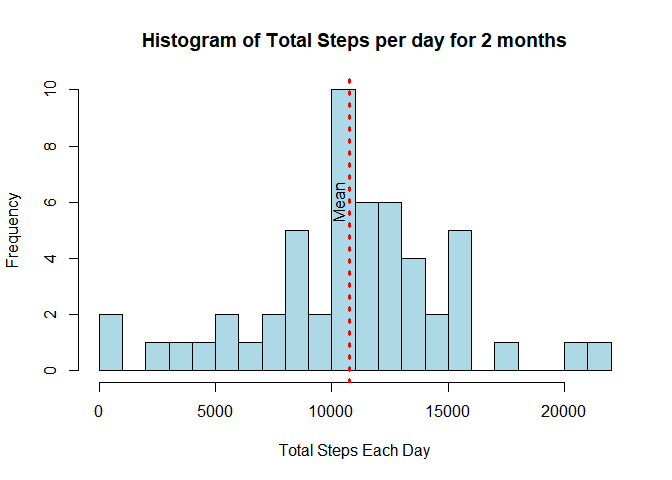
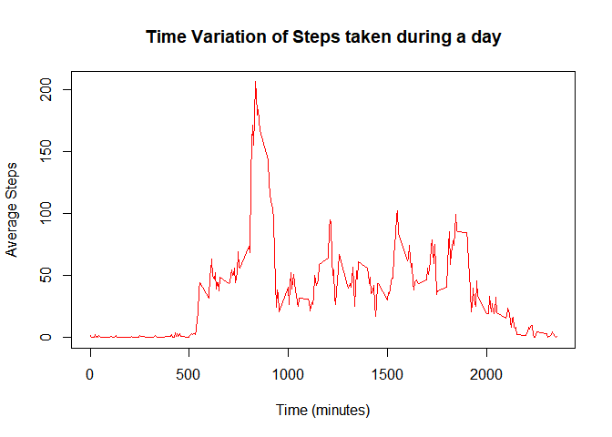
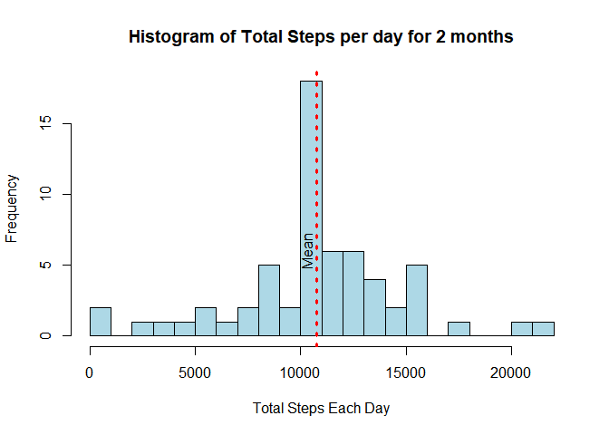
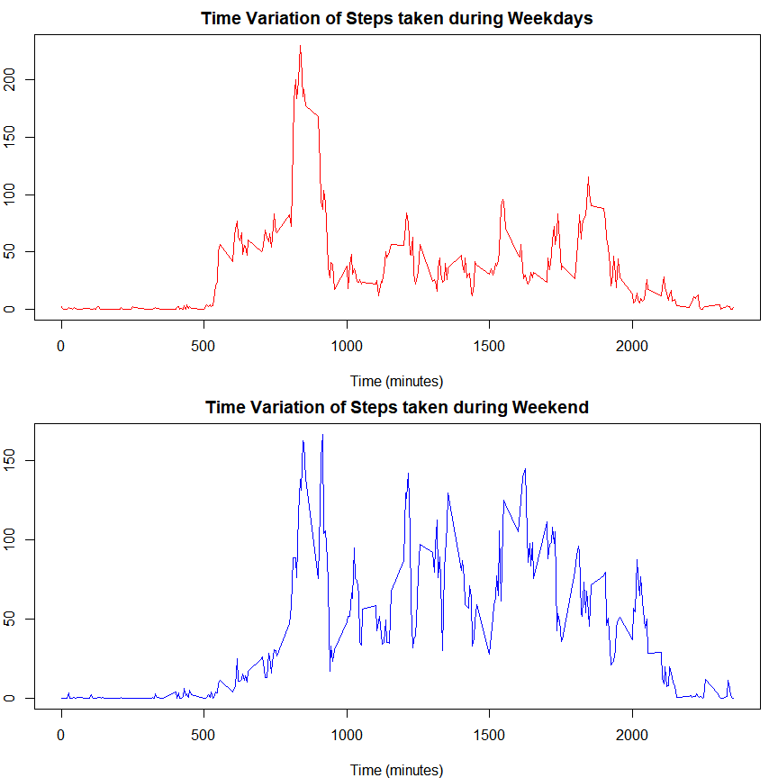

Introduction
------------

This data is a part of the research in the "Quantified Self" movement,
in which the individuals through use of modern devices can track their
personal activities as well as health. This data is then processed and
analyzed to better the health of the individual.

The given data was collected for a duration of 2 months and recorded
activity i.e steps taken every 5 minute. This work aims to get the basic
statistics in form of mean and medians of data, as well a comparison of
activities during weekdays and weekends.

Loading Data
------------

The data is loaded from the
[link](https://d396qusza40orc.cloudfront.net/repdata%2Fdata%2Factivity.zip)
provided within the assignment page. The following code makes sure that
the data files are not downloaded unless they are not found in the
working directory.

    fname<-"ActivityData.zip"
    if(!file.exists(fname)) {
      url<-"https://d396qusza40orc.cloudfront.net/repdata%2Fdata%2Factivity.zip"
      download.file(url, destfile = "ActivityData.zip")
    }
    unzip("ActivityData.zip")
    a_data<-read.csv("activity.csv")

Transforming Data
-----------------

Within the 60 day monitoring period, lot of sensor data is missing. The
first step is to examine the results without imputing the missing data.
Following code

    a_data<-a_data[!is.na(a_data$steps),]
    a_data<-droplevels(a_data)

Calculating Basic Statistics (without Imputation)
-------------------------------------------------

### a)Total Steps each day

For calculating the total number of steps, we will apply the tapply
function on the 'steps' vector with factor variable 'date' and use sum
function.

    t_steps<-tapply(a_data$steps,a_data$date,sum,simplify = T)
    summary(t_steps)

    ##    Min. 1st Qu.  Median    Mean 3rd Qu.    Max. 
    ##      41    8841   10760   10770   13290   21190

### b)Histogram of Total Steps per day

    mean_total<-mean(t_steps)
    names(mean_total)<-"Mean"
    med_total<-median(t_steps)
    names(med_total)<-"Median"
    hist(t_steps,breaks=20,xlab = "Total Steps Each Day",main="Histogram of Total Steps per day for 2 months",col="lightblue")
    abline(v=mean_total,lty=3,lwd=3,col="red")
    text(mean_total-500,6,"Mean",srt=90)

### c)Mean & Median of the total steps taken each day

    mean_total

    ##     Mean 
    ## 10766.19

    med_total

    ## Median 
    ##  10765

### d)Average daily activity pattern

'tapply' function is used to implement summation over the 'steps' vector
with 'intervals' as factor. The output is an array which is coerced to a
data frame. Proper names are given to the column of the result. A new
vector is added to the result i.e 'interval' which is extracted from the
row names of the output. The row names are then set to NULL to restore
the default numbering.

    time_steps<-as.data.frame(tapply(a_data$steps,a_data$interval,mean,simplify = T))
    names(time_steps)<-"steps"
    time_steps$interval<-as.numeric(row.names(time_steps))
    row.names(time_steps)<-NULL
    plot(y=time_steps$steps,x=time_steps$interval,type="l",xlab = "Time (minutes)",ylab="Average Steps",main = "Time Variation of Steps taken during a day",col="red")

### e)Finding 5-minute interval with most steps on an average

    max_step_i<-names(which(time_steps$steps==max(time_steps$steps)))
    max_step_i

    ## [1] "835"

Calculating Basic Statistics (with Imputation)
----------------------------------------------

A simple imputation using the **mean** of steps taken for a particular
interval is done. All the missing rows are first extracted into a
separate data frame. 'match' function is used to lookup the 'interval'
for a particular row in the 'time\_steps' variable (used earlier to
store average steps for each interval) and corrosponding value of
'steps' is returned. This is repeated over all the rows using 'sapply'
function. The rows with imputed data is then merged back with the
original data

    a_data2<-read.csv("activity.csv")
    missing_V<-a_data2[is.na(a_data2$steps),]
    pctage_m<-mean(is.na(a_data2$steps))
    missing_V$steps<-sapply(missing_V$interval,function(x)time_steps$steps[match(x,time_steps$interval)])
    a_data2[is.na(a_data2$steps),]<-missing_V

The original percentage of missing values is shown below. The new
imputed data is stored in 'a\_data2'.

    paste0(as.character(round(pctage_m,4)*100),"%")

    ## [1] "13.11%"

### a)Histogram of Total Steps per day with imputation

    t_steps2<-tapply(a_data2$steps,a_data2$date,sum,simplify = T)
    mean_total2<-mean(t_steps2)
    names(mean_total2)<-"Mean"
    med_total2<-median(t_steps2)
    names(med_total2)<-"Median"

    hist(t_steps2,breaks=20,xlab = "Total Steps Each Day",main="Histogram of Total Steps per day for 2 months",col="lightblue")
    abline(v=mean_total2,lty=3,lwd=3,col="red")
    text(mean_total2-500,6,"Mean",srt=90)

    ## [1] "Original Mean without Imputation: 10766.19"

    ## [1] "New Mean with Imputation: 10766.19"

    ## [1] "Original Median without Imputation: 10765"

    ## [1] "New Median with Imputation: 10766.19"

There is no difference in the new and old mean because the imputed
values are derived from the original mean value. The median has
increased as there are more values weighted towards the mean value than
before.

Difference in activity between Weekdays & Weekends
--------------------------------------------------

To find out if a given date is a weekday or weekend, 'weekdays()'
function has been used. Since this function accepts an argument of
'Date' type, the 'date' vector of 'a\_data2' is first coerced into a
date object. Consequently a new logical vector 'weekd' is added
indicating if a given day is weekend(True) or not(False). 'tapply'
function is then applied on both groups separately to extract the time
series data into two separate variables- 'time\_steps\_we' &
'time\_steps\_wd'.

    a_data2$date<-as.Date(a_data2$date,"%Y-%m-%d")
    a_data2$weekd<-grepl("S.+",weekdays(a_data2$date))
    time_steps_we<-as.data.frame(tapply(a_data2[a_data2$weekd,1],a_data2[a_data2$weekd,3],mean,simplify = T))
    time_steps_wd<-as.data.frame(tapply(a_data2[!a_data2$weekd,1],a_data2[!a_data2$weekd,3],mean,simplify = T))
    names(time_steps_we)<-"steps"
    names(time_steps_wd)<-"steps"
    time_steps_we$interval<-as.numeric(row.names(time_steps_we))
    time_steps_wd$interval<-as.numeric(row.names(time_steps_wd)) 
    par(mfrow=c(2,1),mar=c(4,2,2,1))
    plot(time_steps_wd$steps,x=time_steps_wd$interval,type="l",xlab= "Time (minutes)",ylab="Average Steps",main = "Time Variation of Steps taken during Weekdays",col="red")
    plot(time_steps_we$steps,x=time_steps_we$interval,type="l",xlab= "Time (minutes)",ylab="Average Steps",main = "Time Variation of Steps taken during Weekend",col="blue")

